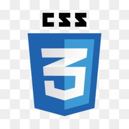

# Welcome to my github!

## I'm **Jorge Borges**.

### About me:

##### I am a university student in the Computer System course at Universidade Federal Fluminense / Rio de Janeiro. 
    
##### My interest is in Web programming.

##### Knowledge in MERN stack:
- HTML/CSS/JS    
- SASS 
- MongoDB

Express framework

React 

NojeJS 

Bulma and Bootstrap 

##### Relational database: PostgreSQL and MySQL.
##### Systems: GNU/Linux, shellscript 
##### Learning:
<ul>
    <li>Ruby  </li>
    <li> Ruby on Rails framework</li>
</ul>

  
